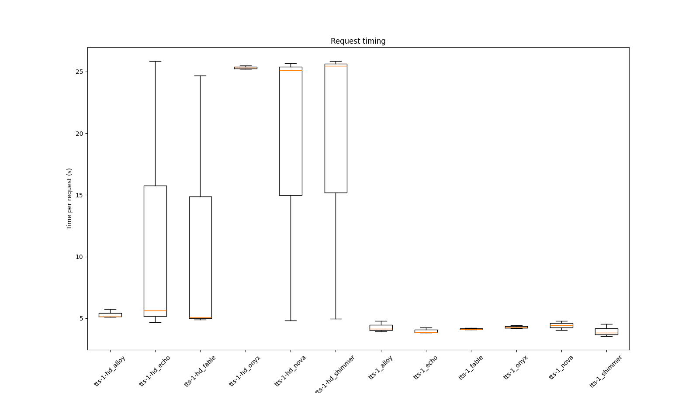
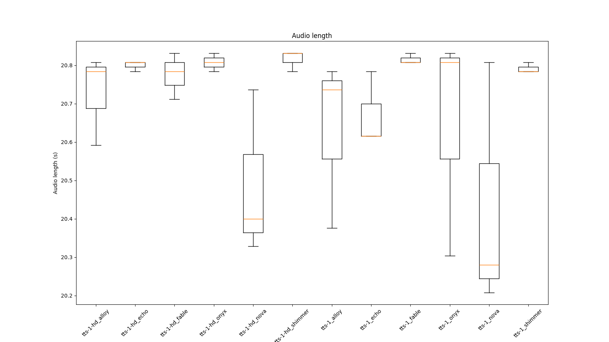

# Analysis of OpenAI Text-to-speech APIs

```
My, občané České republiky v Čechách, na Moravě a ve Slezsku,
v čase obnovy samostatného českého státu,
věrni všem dobrým tradicím dávné státnosti zemí Koruny české i státnosti československé,
odhodláni budovat, chránit a rozvíjet Českou republiku
v duchu nedotknutelných hodnot lidské důstojnosti a svobody
```


## API response time



## Length of generated audio

